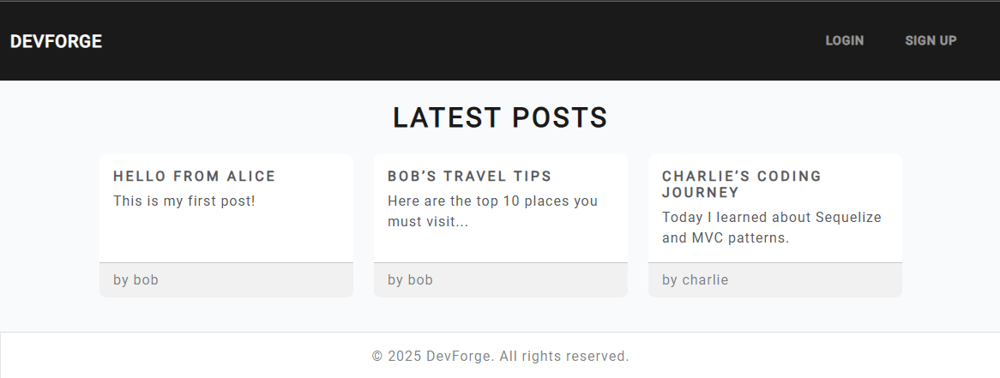

# DevForge

## Description
DevForge is a blogging platform where users can sign up, log in, create posts, and view posts from other users. It demonstrates a complete MVC structure with Node.js, Express.js, Handlebars.js, Sequelize (PostgreSQL), authentication via sessions, and deployment on Render.



## Technologies Used
- Node.js
- Express.js
- Handlebars.js
- PostgreSQL
- Sequelize ORM
- express-session
- dotenv
- Multer
- Bootstrap
- Render

## Installation

1. Clone the repository:
   ```bash
   git clone https://github.com/Samuelthenm/Second-project.git

2. Navigate to the project directory
'''bash
cd Second-project

3. Install dependencies 
'''bash
npm install

4. Create a .env file in the root directory and add the following:

DB_NAME=devforge_db

DB_USER=postgres

DB_PASSWORD=YOUR_PASSWORD 'add your own password'

DB_HOST=localhost

DB_PORT=5432

SESSION_SECRET=express-session

5. Create the PostgresSQL database:
'''sql
CREATE DATABASE devforge_db;

6. Seed the database:
'''bash
npm run seed

7. Start the server:
'''bash
npm start

8. Open http://localhost:3001 in your browser.

## Usage

Sign Up: Create a new account.
Log In: Access your dashboard.
Create Posts: Add new blog posts.
View Posts: Browse posts from all users.
Log Out: End your session.